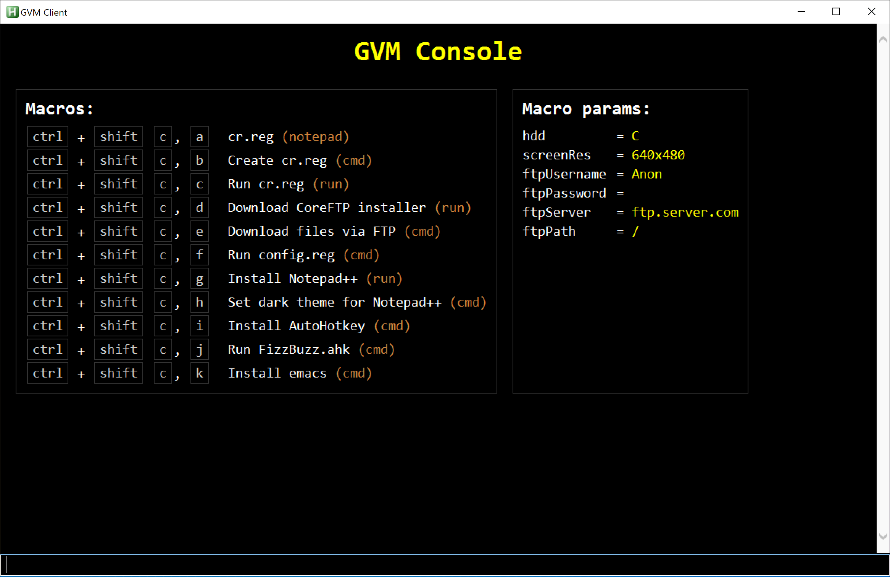

# GVM Console
A macro manager and console GUI, for usage with turn-based collaborative VMs such as https://computernewb.com/collab-vm/
Parameters are plugged into the macros' format strings and can be set via the console field, e.g. "hdd = C"

## Screenshot

## Author
Coe Joder
